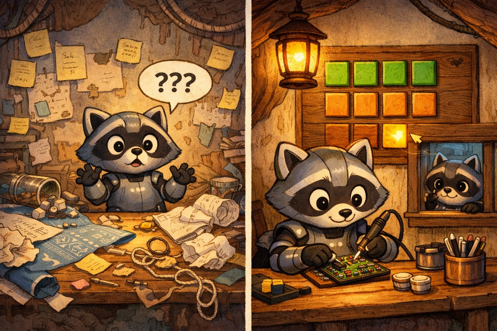

<p align="center">
  
</p>

<h1 align="center">tile</h1>

<p align="center">
  <em>A local issue tracker built for AI coding agents.</em>
</p>

<p align="center">
  <a href="https://github.com/otherland/tile/actions/workflows/test.yml"></a>
  <a href="https://pypi.org/project/tile-cli/"></a>
  <a href="LICENSE"></a>
</p>

<p align="center">
  <a href="#install">Install</a> &middot;
  <a href="#usage">Usage</a> &middot;
  <a href="#how-it-works">How it works</a> &middot;
  <a href="#commands">Commands</a> &middot;
  <a href="LICENSE">MIT License</a>
</p>

---

## The problem

AI coding agents are getting good at writing code. They're terrible at remembering what to work on next.

An agent finishes a task. It needs context: what's open, what's blocked, what order to do things in. Today that context lives in your head, in a GitHub project board the agent can't see, or in a CLAUDE.md file you manually update every session. The agent starts every conversation blind, and you spend the first five minutes re-explaining where things stand.

Issue trackers exist, but they're all remote. They need API keys, network calls, and rate limits. They're designed for teams of humans, not for a single agent working in a repo. The overhead of syncing state to Jira so your agent can read it back is absurd.

**What's missing is a tracker that lives in the repo, works offline, and speaks JSON.**

## The solution

tile is a single Python file. No dependencies. No server. No config. Issues live in SQLite. One command gives an agent everything it needs to start a session.

```bash
tile init
tile create "Set up database schema" --type task -p 1
tile create "Implement auth" --type feature -p 0
tile dep add tl-a1f3c2 tl-e9b1d4   # auth blocked by schema
tile prime                           # agent session dashboard
```

`tile prime` returns a single JSON object: what's in progress, what's ready to work on next (sorted by impact), what's blocked and by what, and basic stats. One call, one DB read, full context.

When stdout is not a TTY — which is every time an agent calls it — tile outputs JSON automatically. Humans get a colour-coded dashboard. No `--json` flag to remember.

## Install

```bash
pip install tile-cli
```

Or just copy the file. It's one file with no dependencies:

```bash
curl -o tile.py https://raw.githubusercontent.com/otherland/tile/main/tile.py
chmod +x tile.py
alias tile="python3 $(pwd)/tile.py"
```

Requires Python 3.10+.

## Usage

### For agents

Add to your project's `CLAUDE.md` (or equivalent):

```
This project uses `tile` for issue tracking. Run `tile prime` at the start
of each session to get context. Update issue status as you work.
```

That's it. The agent calls `tile prime`, gets JSON, knows what to do.

### For humans

```bash
tile                              # dashboard (same as tile prime)
tile create "Fix login bug" --type bug -p 0
tile list --ready                 # what can be worked on now
tile list --blocked               # what's stuck and why
tile update tl-a1 --status closed --reason "Fixed in abc123"
```

### Bulk operations

Agents can create entire work plans atomically:

```bash
echo '[
  {"op": "create", "title": "Set up DB schema", "priority": 1},
  {"op": "create", "title": "Implement auth", "priority": 0},
  {"op": "dep_add", "child": "$1", "parent": "$0"}
]' | tile batch
```

`$0` and `$1` are back-references to earlier operations. The entire batch runs in a single transaction — if anything fails, nothing is committed.

## How it works

tile stores issues in a SQLite database at `.tile/tile.db`. That's the source of truth. Every operation is a local DB call, no network involved.

For git integration, `tile sync push` exports all issues to `.tile/issues.jsonl` — one JSON object per line, one line per issue. Check that file into git and it becomes mergeable across branches using git's built-in three-way merge. `tile sync pull` reads it back in.

### Dependencies and impact

Issues can block other issues. tile uses this to answer the question agents actually care about: **"what should I work on next?"**

`tile list --ready` returns unblocked issues sorted by impact — the number of downstream issues that would be unblocked by closing each one. An issue that gates six others sorts above a priority-0 issue that gates nothing.

### ID prefix matching

IDs work like git short hashes. `tile show tl-a1` resolves to `tl-a1f3c2` if unambiguous. No need to copy-paste full IDs.

### Auto-JSON

If stdout is a TTY, you get human-readable colour output. If it's piped or called by an agent, you get JSON. `--json` and `--human` override this.

## Commands

| Command | What it does |
|---|---|
| `tile` | Dashboard. Same as `tile prime`. |
| `tile init` | Create a `.tile/` workspace in the current directory. |
| `tile create <title>` | Create an issue. Flags: `--type`, `-p`, `--description`, `--assignee`, `--labels`. |
| `tile show <id>` | Full detail on one issue, including deps and comments. |
| `tile update <id>` | Change fields. `--status closed --reason "done"` to close, `--status open` to reopen. |
| `tile delete <id>` | Hard delete an issue and its deps/comments. |
| `tile list` | Query with composable filters: `--ready`, `--blocked`, `--stale`, `--search`, `--status`, `--priority`, `--type`, `--assignee`, `--label`, `--sort`, `--reverse`. |
| `tile prime` | Agent session context. In-progress, ready, blocked, recent activity, stats. |
| `tile batch` | Atomic multi-operation from stdin JSON. Supports `$N` back-references. |
| `tile dep add/remove/list/tree` | Manage dependencies between issues. |
| `tile label add/remove/list` | Manage labels on issues. |
| `tile comment add/list` | Add notes to issues. |
| `tile sync push/pull/status` | Export/import JSONL for git integration. |
| `tile stats` | Project statistics. `--by status/type/priority/assignee` for grouped counts. |
| `tile doctor` | Validate database integrity. |

## Design

- **Single file, stdlib only.** No pip install required. Copy it and go.
- **SQLite, not flat files.** Proper transactions, WAL mode, foreign keys. Fast at any scale you'd use this at.
- **Agent-first, human-friendly.** JSON by default for machines, colour tables for humans. Same commands either way.
- **Git-friendly.** JSONL export is one line per issue — minimal, stable diffs. Deps live on the child issue only, so adding a dependency changes one line.
- **No network, no config, no daemon.** tile reads and writes `.tile/` and nothing else.

## License

MIT License. See [LICENSE](LICENSE) for details.
